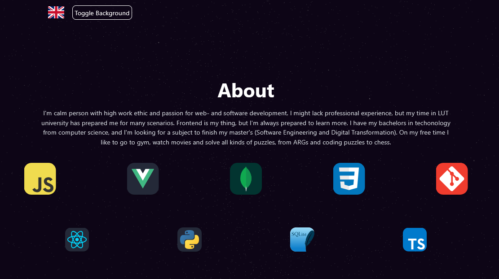

# **react-r3f-portfolio**

Web portfolio made with React, Next.js and TailwindCSS. Backgound "stars" were made with Three.js and React-three-fiber. The site is made to showcase my skills and projects and is available in English and Finnish. Site is running [here](https://purkkilo-portfolio-purkkilos-projects.vercel.app/).

## **Stack**

- **User interface** with [React](https://react.dev/) and [TailwindCSS](https://tailwindcss.com/) using [Next.js](https://nextjs.org/)

## **Installation**

1. **npm install**
2. **npm run dev**

This project was bootstrapped with [`create-r3f-app`](https://github.com/utsuboco/create-r3f-app)
